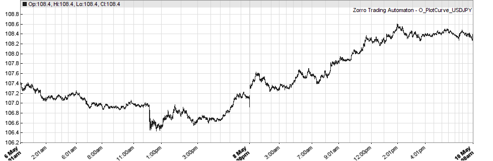

# TrueFX-to-Zorro
Convert TrueFX.com tick data to Zorro-Trader.com .t6 bar format

## In and Out

######Download URL example (requires login after free registration)
[http://truefx.com/dev/data/2016/MAY-2016/EURUSD-2016-05.zip](http://truefx.com/dev/data/2016/MAY-2016/EURUSD-2016-05.zip)

######Content
EUR/USD,20160502 00:00:00.959,1.14601,1.14605   
EUR/USD,20160502 00:00:00.991,1.14599,1.14605   
EUR/USD,20160502 00:00:01.018,1.14599,1.14604  
EUR/USD,20160502 00:00:01.078,1.14599,1.14605

######Zorro .t6 format
`typedef struct T6
{
  DATE  time; //double, 8bytes, base 1900-01-01
  float fHigh, fLow;  //single
  float fOpen, fClose;	
  float fVal, fVol; // additional data, like ask-bid spread, volume etc.
} T6;`

## Aggregation
Each bar contains predefined number of ticks, like 1000. Time increment is irregular then. Cut also for weekends, holidays.

###### Spread Increase Before Weekend
USD/JPY,20160506 20:59:56.266,107.089996,107.166  
USD/JPY,20160506 20:59:56.291,107.089996,107.209999  
USD/JPY,20160506 20:59:56.414,**106.986,107.265999**  
USD/JPY,20160506 20:59:58.136,**106.986,107.265999**  
USD/JPY,20160506 20:59:59.085,**106.978996,107.273003**  
USD/JPY,20160506 20:59:59.203,**106.978996,107.273003**  
USD/JPY,20160506 20:59:59.437,**106.917999,107.488998**  
USD/JPY,20160509 00:00:00.026,107.359001,107.366997  
USD/JPY,20160509 00:00:00.140,107.359001,107.366997  

## Example conversion
[ZHistoryEdit.exe](http://www.zorro-trader.com/download.php) (linked from [Zorro download page](http://www.zorro-trader.com/download.php)) can create .t6 files 

## Forum links
[standalone conversion](http://codereview.stackexchange.com/questions/38275/convert-between-date-time-and-time-stamp-without-using-standard-library-routines)
see also CRAN lubridate source